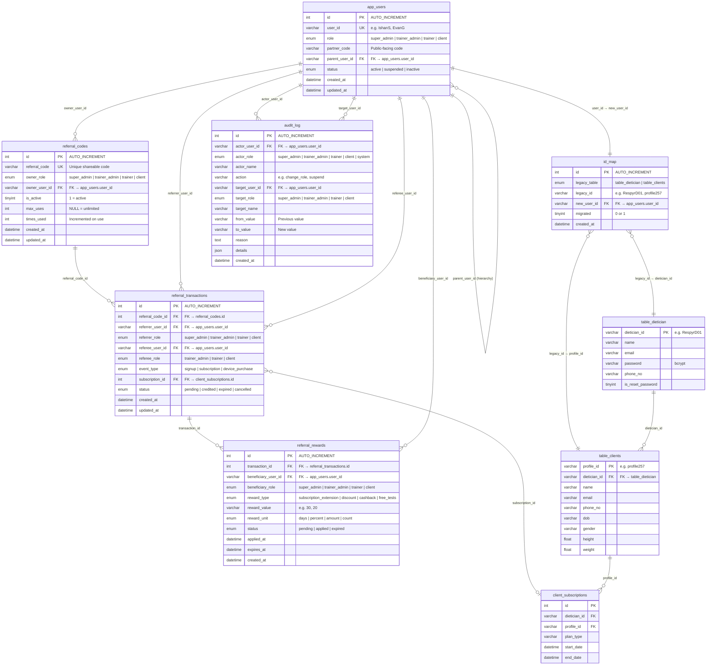

# ER Diagram — v3 Schema (6 New Tables + Legacy Bridge)

> For Monday May 19 session with Chandan
> Shows all 6 new tables, their relationships, and how they bridge to legacy tables via `id_map`.



---

## Hierarchy Chain (self-referencing `app_users.parent_user_id`)

```
Super Admin (IshanS)
  ├── Trainer Admin (EvanG?)
  │     ├── Trainer (MarcusH)
  │     │     ├── Client (profile257)
  │     │     └── Client (profile312)
  │     └── Trainer (SarahK)
  └── Trainer Admin (DerekL?)
        └── Trainer (KaiN)
```

## Bridge Pattern (login JOIN)

```sql
-- Login: email → table_dietician → id_map → app_users
SELECT au.role, au.parent_user_id, au.partner_code, au.status,
       d.name, d.email, d.phone_no, d.is_reset_password
FROM table_dietician d
JOIN id_map m ON m.legacy_id = d.dietician_id AND m.legacy_table = 'table_dietician'
JOIN app_users au ON au.user_id = m.new_user_id
WHERE d.email = ?
```

## Quick Reference

| New Table | Points to | Via |
|-----------|-----------|-----|
| `app_users` | itself | `parent_user_id → user_id` |
| `id_map` | `app_users` + legacy tables | `new_user_id` + `legacy_id` |
| `referral_codes` | `app_users` | `owner_user_id` |
| `referral_transactions` | `referral_codes` + `app_users` × 2 | `referral_code_id` + `referrer/referee_user_id` |
| `referral_rewards` | `referral_transactions` + `app_users` | `transaction_id` + `beneficiary_user_id` |
| `audit_log` | `app_users` × 2 | `actor_user_id` + `target_user_id` |
